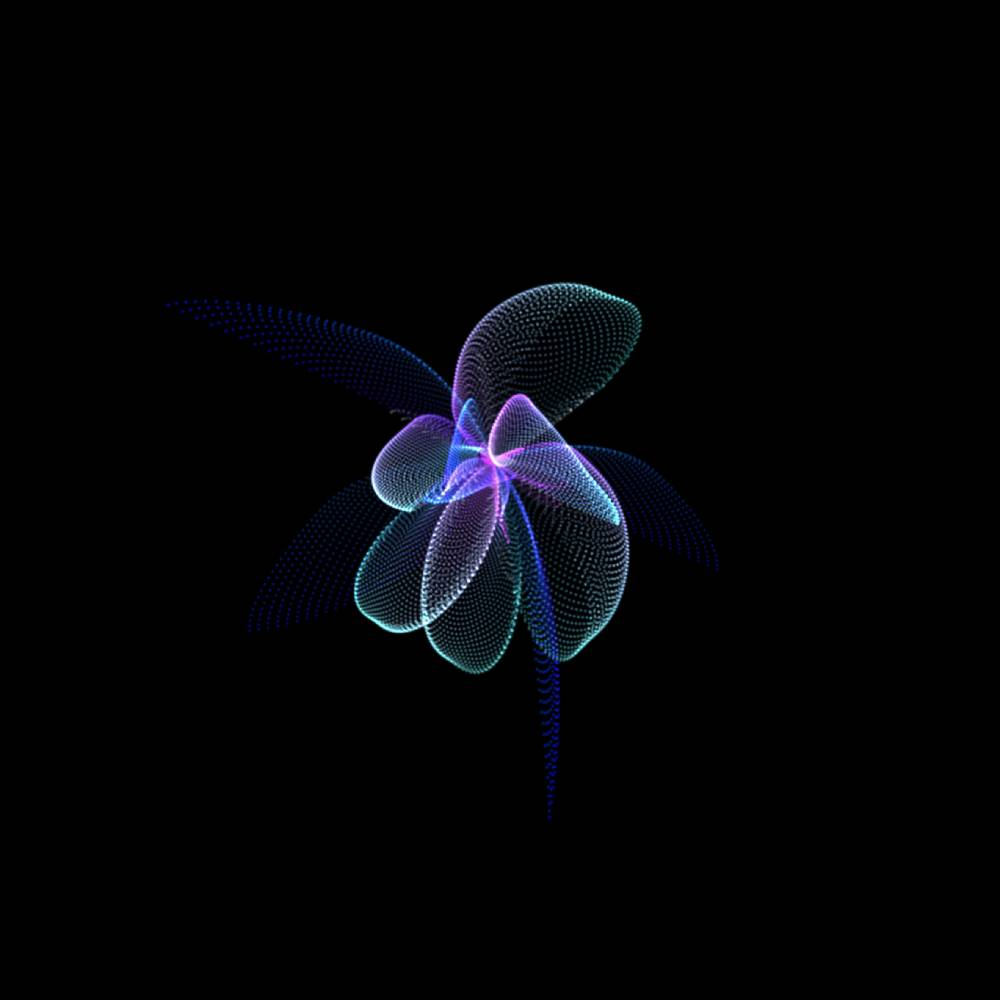

<h1 align="center">
GL Playground | <a href="http://tomhsiao1260.github.io/gl-playground/" target="_blank">Demo</a>
</h1>

    

## Introduction

This is my personal [WebGL](https://github.com/KhronosGroup/WebGL) and [Three.js](https://threejs.org/) experimental playground. This is not only a space for me to create some cool things but also a place to share my works which mainly using [GLSL shading language](https://www.khronos.org/opengl/wiki/Core_Language_(GLSL)). All the examples I wrote are open source and can be found [here](https://github.com/TomHsiao1260/gl-playground/tree/main/dist/examples). Feel free to use them in your own projects. You can also fork this repository and come back to see more examples released in the future. If you like my works, giving me a star will drive me to do more 🙌.

## Inspiration

I also collect some useful resources for me to learn or get more inspiration.

- [Fluid Simulation](http://jamie-wong.com/2016/08/05/webgl-fluid-simulation/)
- [Etienne Jacob](https://twitter.com/etiennejcb)
- [Zach Lieberman](https://twitter.com/zachlieberman)
- [WebGL water](https://github.com/evanw/webgl-water)
